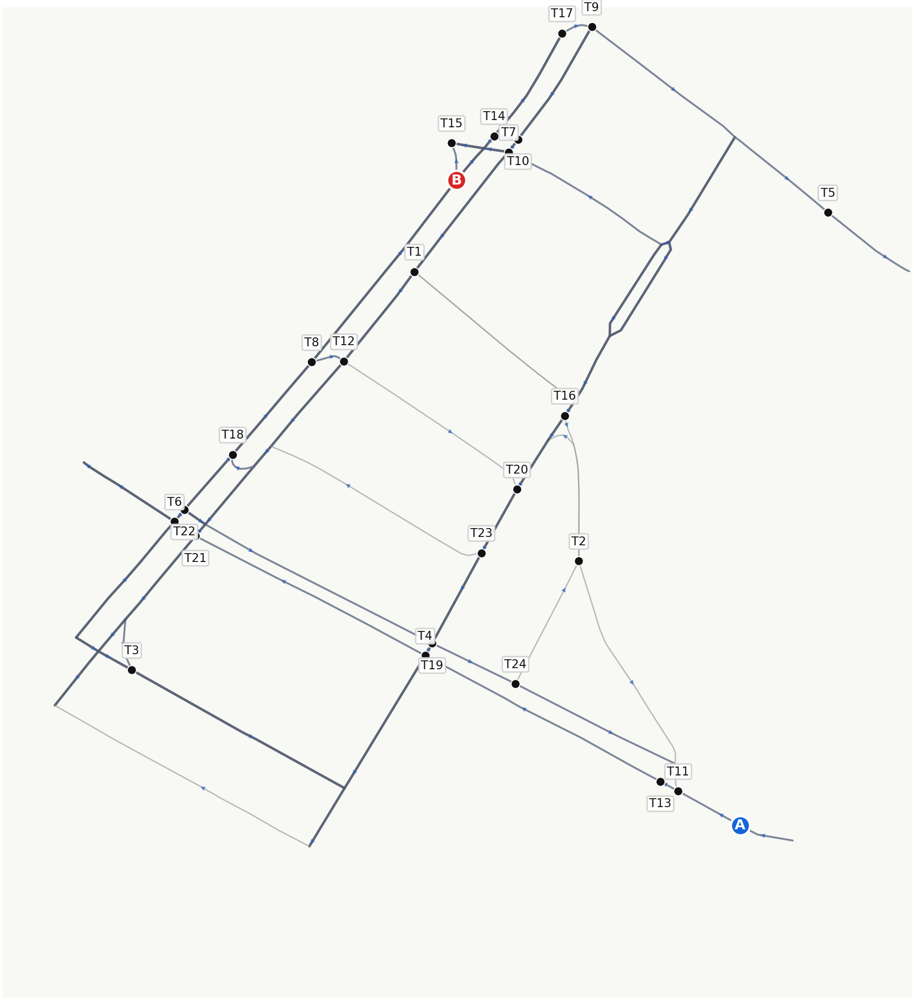
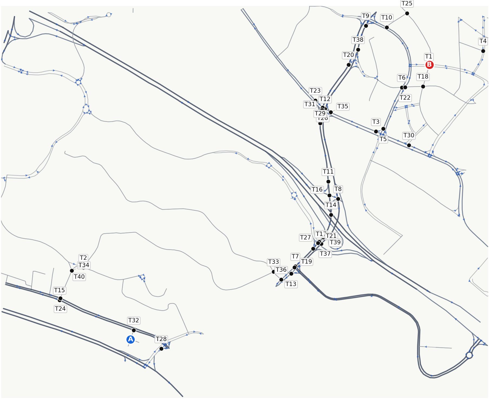
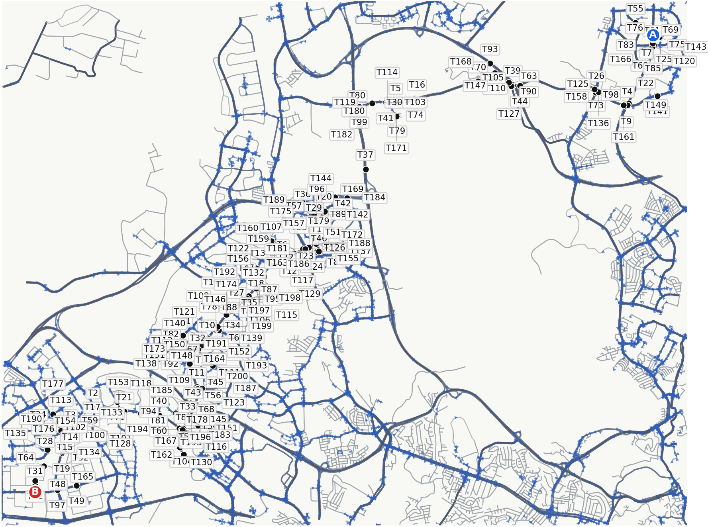
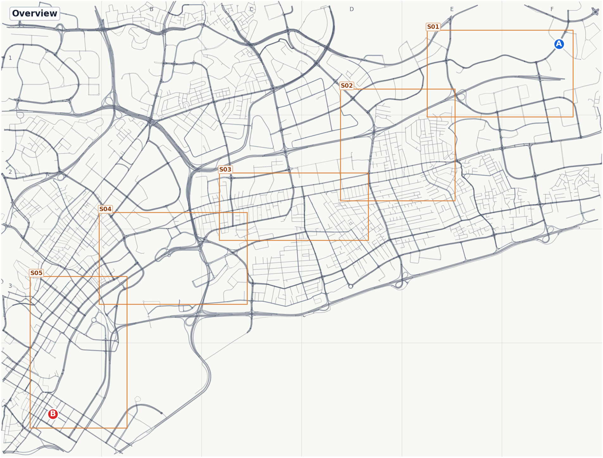
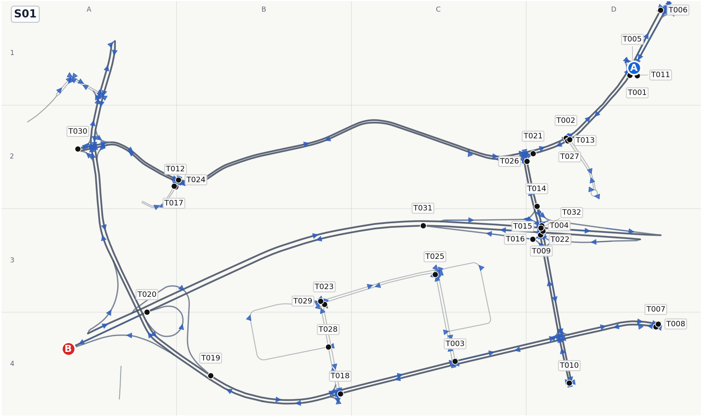
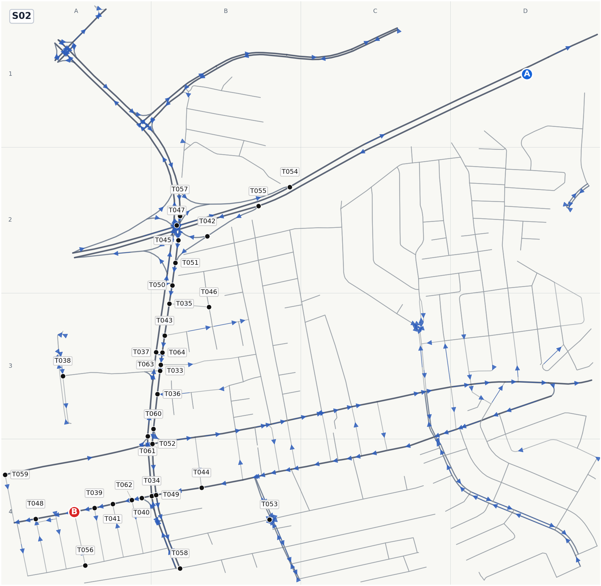
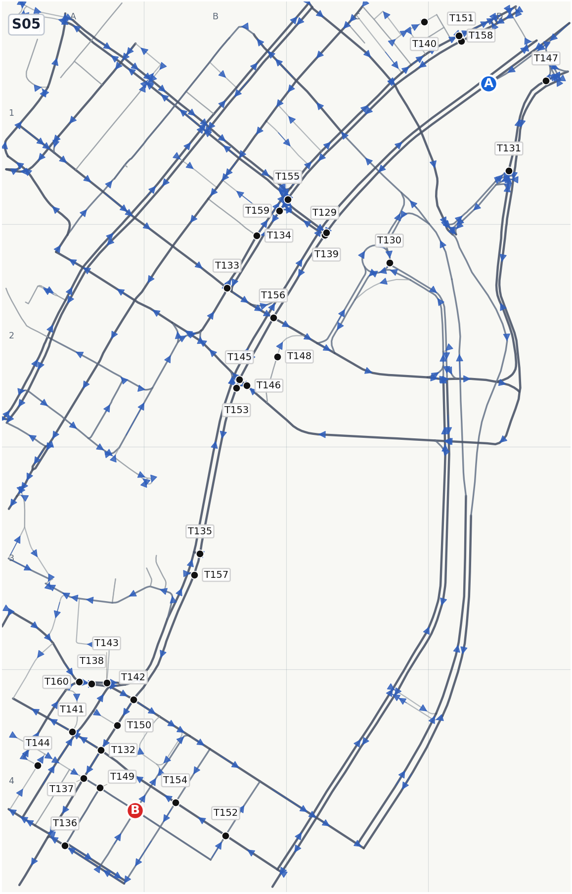

# RouteRL Model Test Report

This report summarizes the checked-in experiment bundle under
`data/experiments/`. The most important result is that flat long-route maps are
too visually cluttered, while the route-strip format gives us a repeatable
multi-image interface for longer driving tasks.

## Data Bundle

Generated artifacts are organized by experiment, not by flat output folder:

```text
data/experiments/<experiment_name>/
  tasks.jsonl
  maps/
  predictions/
  results/
  overlays/
```

The old ambiguous debug folders were renamed into smoke fixtures:

```text
data/experiments/_smoke/short_generator_before_cli_guard/
data/experiments/_smoke/short_generator_after_cli_guard/
```

Those are kept only as tiny generator sanity examples. The real experiments are
the named short, medium, long, and route-strip folders below.

The current bundle is about `77M`; the largest single file is the long 80cp
`tasks.jsonl` at about `27M`, so the files are small enough to commit directly
without hitting GitHub's 100 MB per-file limit.

## Prompt Shape

For a flat task, the model sees one map image and must return JSON only:

```json
{"turns":["T03","T11","T14"]}
```

For a route-strip task, the model sees one overview image plus one local image
per segment and must return:

```json
{"segments":[{"segment_id":"S01","turns":["T001","T011"]}]}
```

The prompts ask for route labels only. Extra keys in legacy prediction files are
ignored, but new prediction artifacts should only emit route labels.

## Baselines

`oracle` is the hidden teacher answer from the OSMnx shortest driving path. It
should score `1.000`; if oracle fails, the task or verifier is broken.

`greedy` repeatedly picks a visible checkpoint closer to the destination by
straight-line distance. It does not know one-way streets, road classes, or graph
connectivity. It is useful as a cheap sanity baseline: a VLM format that cannot
beat greedy needs prompt/image work.

`random` samples visible checkpoint labels randomly.

`empty` returns no turns.

## Experiment Inventory

| Experiment | Tasks | Distance | Gold turns | Checkpoints | Kept outputs |
|---|---:|---:|---:|---:|---|
| `short_500m_2km` | 20 | 613m-1714m | 6-16 | 24 | oracle, random, greedy |
| `medium_2_6km` | 5 | 2654m-5435m | 15-40 | 40 | oracle, greedy |
| `long_8_25km_80cp_probe` | 10 | 8622m-23515m | capped at 80 | 80 | oracle, greedy |
| `long_8_25km_200cp_probe` | 2 | 21593m-23276m | 98-136 | 200 | oracle |
| `long_8_25km_route_strip_probe` | 4 | 13271m-23140m | 5-8 segments | <=32 per segment | oracle, greedy, Qwen 8B limit 1 |

## Short 500m-2km

This is the small single-image debugging setup. It proves the graph, renderer,
prompt parser, and verifier work on manageable trips.



| Predictor | Mean score | Success | Valid routes |
|---|---:|---:|---:|
| Oracle | 1.000 | 20/20 | 20/20 |
| Random | 0.277 | 0/20 | 7/20 |
| Greedy | 0.469 | 0/20 | 14/20 |

Random and greedy are deliberately weak, but they establish that the verifier
is not just rewarding any parseable JSON.

## Medium 2-6km

Medium tasks are still single-image, but routes are long enough to expose loose
planning behavior.



| Predictor | Mean score | Success | Valid routes |
|---|---:|---:|---:|
| Oracle | 1.000 | 5/5 | 5/5 |
| Greedy | 0.691 | 0/5 | 5/5 |

Greedy often chooses one checkpoint that lies on the hidden route, so the graph
route can be valid while checkpoint coverage stays poor:

```text
greedy mean_length_ratio=1.000
greedy mean_route_distance_m=0.0
greedy mean_score=0.691
```

That is why score, checkpoint coverage, and route validity must be read
together.

## Flat Long-Route Probes

The 80-checkpoint long probe intentionally stress-tests the flat single-image
design:

```text
data/experiments/long_8_25km_80cp_probe/
distance: 8622m-23515m
gold turns: all capped at 80
oracle: mean_score=1.000, success=10/10, valid_route=10/10
greedy: mean_score=0.690, success=0/10, valid_route=10/10
```

The 200-checkpoint probe removes the cap for two examples:



```text
task 1: distance=23276m, gold_turns=136, checkpoints=200, graph_edges=11220
task 2: distance=21593m, gold_turns=98, checkpoints=200, graph_edges=6627
```

The conclusion is not "add more labels." More labels make the map an OCR and
clutter problem. Long driving needs local panels.

## Route-Strip Long-Route Probe

The route-strip probe converts long tasks into one overview plus several local
segment images. Segment labels are globally unique across the whole strip, so
the model does not have to disambiguate reused `T01` labels between segments.

```text
data/experiments/long_8_25km_route_strip_probe/
task 1: distance=13270m, segments=5, segment distance=2520m-2806m, max segment turns=24
task 2: distance=13887m, segments=5, segment distance=2534m-3040m, max segment turns=25
task 3: distance=17428m, segments=7, segment distance=1603m-3082m, max segment turns=26
task 4: distance=23140m, segments=8, segment distance=2510m-3327m, max segment turns=27
checkpoints: <=32 per segment
```

Overview image:



Local segment examples:







Route-strip scoring:

| Predictor | Mean score | Success | Valid schema | Valid route |
|---|---:|---:|---:|---:|
| Oracle | 1.000 | 4/4 | 4/4 | 4/4 |
| Greedy | 0.487 | 0/4 | 4/4 | 2/4 |
| Qwen3-VL-8B strip, limit 1 | 0.068 | 0/1 | 1/1 | 0/1 |

The first Qwen route-strip sample is useful because it exposes a clean failure
mode:

```text
file: data/experiments/long_8_25km_route_strip_probe/predictions/qwen3_vl_8b_strip_limit1.jsonl
result: score=0.068, valid_schema=true, valid_route=false
behavior: selected every visible checkpoint in every segment
gold turns for task 1: 74 total across segments
predicted turns for task 1: 160 total across segments
```

So the multi-image prompt is parseable, but the model treated the task as
"list all labels" instead of "choose sparse turns needed for the route." The
next prompt/training work should reward sparse useful checkpoints and penalize
loop-heavy all-label outputs.

The current route-strip scaffold uses oracle-derived segment endpoints. That is
intentional for now: it isolates local visual driving decisions from the later
global corridor-planning problem. Once local segment routing improves, the next
stage can ask the model or a planner policy to choose broad corridors.

## Browser Overlay

The browser viewer reads the same JSONL files and draws graph edges, oracle
routes, agent routes, checkpoints, scores, and route-strip segment boxes.

Run from the repo root:

```bash
bash scripts/serve_overlay.sh --port 8000 --bind 0.0.0.0
```

Then open with SSH or IDE port forwarding if the GPU box is remote:

```text
http://localhost:8000/renderer/route_overlay.html?tasks=/data/experiments/long_8_25km_route_strip_probe/tasks.jsonl&predictions=/data/experiments/long_8_25km_route_strip_probe/predictions/qwen3_vl_8b_strip_limit1.jsonl&results=/data/experiments/long_8_25km_route_strip_probe/results/qwen3_vl_8b_strip_limit1.jsonl
```

If `http://<server-ip>:8000` refuses to connect, the server process may still be
fine; the cloud firewall is probably blocking that public port. `localhost` in
the URL means the machine where the browser is running.

## Reproduce

Rebuild the route-strip probe:

```bash
source routerl/bin/activate

EXP=data/experiments/long_8_25km_route_strip_probe
mkdir -p "$EXP"/{maps,predictions,results,overlays}

python scripts/make_route_strip_tasks.py \
  --tasks data/experiments/long_8_25km_80cp_probe/tasks.jsonl \
  --out "$EXP/tasks.jsonl" \
  --target-segment-distance-m 2500 \
  --max-segment-checkpoints 32 \
  --segment-margin-m 260 \
  --limit 4

python scripts/render_route_strip_tasks.py \
  --tasks "$EXP/tasks.jsonl" \
  --out-dir "$EXP/maps" \
  --write-updated-tasks "$EXP/tasks.jsonl"
```

Run the baselines:

```bash
python scripts/make_oracle_predictions.py \
  --tasks "$EXP/tasks.jsonl" \
  --out "$EXP/predictions/oracle.jsonl"

python scripts/make_greedy_predictions.py \
  --tasks "$EXP/tasks.jsonl" \
  --out "$EXP/predictions/greedy.jsonl"

python scripts/evaluate_predictions.py \
  --tasks "$EXP/tasks.jsonl" \
  --predictions "$EXP/predictions/oracle.jsonl" \
  --out "$EXP/results/oracle.jsonl"

python scripts/evaluate_predictions.py \
  --tasks "$EXP/tasks.jsonl" \
  --predictions "$EXP/predictions/greedy.jsonl" \
  --out "$EXP/results/greedy.jsonl"
```

Run one VLM sample:

```bash
python scripts/run_hf_agent.py \
  --tasks "$EXP/tasks.jsonl" \
  --model Qwen/Qwen3-VL-8B-Instruct \
  --out "$EXP/predictions/qwen3_vl_8b_strip_limit1.jsonl" \
  --limit 1 \
  --device auto \
  --dtype bfloat16 \
  --max-new-tokens 1536 \
  --sanitize-labels

python scripts/evaluate_predictions.py \
  --tasks "$EXP/tasks.jsonl" \
  --predictions "$EXP/predictions/qwen3_vl_8b_strip_limit1.jsonl" \
  --out "$EXP/results/qwen3_vl_8b_strip_limit1.jsonl"
```

## Interpretation

The project is now past "can we generate and score tasks?" The answer is yes:
oracle validates the graph/verifier, greedy gives a cheap non-model baseline,
and Qwen produces parseable JSON.

The actual research problem is now visual route optimization. For long routes,
the best current interface is route strips with overview context, local panels,
small per-segment label sets, stitched verification, and eventually RL rewards
that punish invalid detours and all-label outputs.
